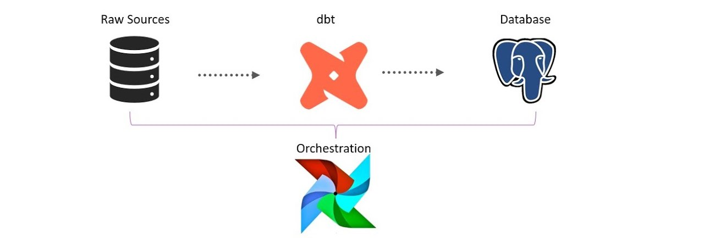

# Sales Project (dbt)

This repository contains a dbt demo project that shows a layered analytics architecture with staging and marts. The project includes Docker Compose services to run Postgres (data warehouse) and Airflow (orchestration) for local development and demos.

**Contents**
- `models/staging/` — lightweight staging models that clean and cast raw seed/source data (stg_*).
- `models/marts/` — conformed dimensions and fact tables (dim_*, fct_*).
- `seeds/` — CSV files used as the raw data source for the demo.
- `dags/` — Airflow DAGs used to orchestrate dbt runs (see `dags/dbt_workflow.py`).

**Architecture**
- Layering: seeds -> staging (`stg_*`) -> marts (`dim_*`, `fct_*`).
- Warehouse: PostgreSQL (containerized via `docker-compose.yaml`) is provided as the primary target for this project.
- Orchestration: Apache Airflow is included (via Docker Compose) to schedule and run dbt workflows.

## Orchestration — Airflow

This repository includes an Airflow service in `docker-compose.yaml`. The DAGs folder is `dags/` and contains `dbt_workflow.py`, which shows an example DAG that runs dbt commands.

Start Airflow (build & run the `airflow` service):

```powershell
docker compose up -d --build airflow
```

To view the Airflow UI, open `http://localhost:8080` (credentials depend on your `docker-compose.yaml` configuration).

Trigger the provided DAG manually from the UI or wait for its schedule. The DAG demonstrates running `dbt deps`, `dbt seed`, `dbt run`, and `dbt test` in sequence.

## Warehouse — PostgreSQL

A Postgres service is configured in `docker-compose.yaml` and intended to be used as the project's data warehouse.

Start Postgres:

```powershell
docker compose up -d --build postgres
```

Default Postgres connection (as configured in the project compose):

- database: `sales_warehouse`
- user: `user`
- password: `password`
- port: `5432`

dbt `profiles.yml` in the project root is pre-configured for this Postgres instance. To use it without moving the file, set:

```powershell
$env:DBT_PROFILES_DIR = (Get-Location).Path
```

Then run the usual dbt workflow:

```powershell
dbt deps
dbt seed --select Client_Table,Expense_Table,Property_Table,Sales_Table --full-refresh
dbt run
dbt test --select marts
```

## Quick Commands

- Install packages declared by dbt (if any):

```powershell
dbt deps
```

- Load CSV seeds into the target database (use `--full-refresh` to overwrite):

```powershell
dbt seed --select Client_Table,Expense_Table,Property_Table,Sales_Table --full-refresh
```

- Compile models (render Jinja templates):

```powershell
dbt compile
```

- Run all models:

```powershell
dbt run
```

- Run only marts:

```powershell
dbt run --select marts
```

- Run tests (schema & data tests):

```powershell
dbt test --select marts
```

- Generate and serve docs locally (default port shown here as example):

```powershell
dbt docs generate
dbt docs serve --port 8081
```

## Notes on DuckDB and Compatibility

The project was originally scaffolded with DuckDB compatibility in mind. If you switch the target to Postgres, review SQL functions and any adapter-specific behavior in the models (e.g., date/time functions).

## Where to look

- Staging models: `models/staging/`
- Marts: `models/marts/`
- DAGs: `dags/dbt_workflow.py`

## Recommended next steps

- Run `dbt test --select marts` to validate schema tests.
- If running via Airflow, open the Airflow UI and inspect `dbt_workflow` DAG to see the example orchestration.

## Contact

If you want additional README content — diagrams, CI examples, or a metrics README — say which area to prioritize and I will expand this file.

---

Generated by project scaffolding automation.

Welcome to your dbt project!
# Sales Project (dbt)

This repository contains a small dbt project that demonstrates a layered analytics architecture using DuckDB and dbt.

Contents
- `models/staging/` — lightweight staging models that clean and cast raw seed/source data (stg_*).
- `models/marts/` — conformed dimensions and fact tables (dim_*, fct_*).
- `seeds/` — CSV files used as the raw data source for the demo.
- `models/marts/schema.yml` — schema tests for key constraints and relationships.

Design summary
- Layering: sources (seeds) -> staging (`stg_*`) -> marts (`dim_*`, `fct_*`). Keep staging minimal and push business logic into marts.
- Schema: star-schema with conformed dimensions (`dim_clients`, `dim_properties`, `dim_date`) and facts (`fct_sales`, `fct_expenses`).
- Materializations: dimensions as `table`; facts as `incremental` for efficient refresh.

Prerequisites
- Python 3.10+ and pip
- dbt-core and the DuckDB adapter are installed in the repository virtualenv (see `env/` in this project).

Postgres notes
- This repository includes a `docker-compose.yaml` that starts a Postgres instance pre-configured for this project.
- The included Postgres credentials in `docker-compose.yaml` are:
  - database: `sales_warehouse`
  - user: `user`
  - password: `password`
  - port: `5432`

Using Postgres with dbt
- A `profiles.yml` for dbt is provided at the project root and configured to use the Postgres instance. dbt looks for `profiles.yml` in `~/.dbt/` by default. To use the included file without moving it, set the environment variable `DBT_PROFILES_DIR` to the project root before running dbt:

```powershell
$env:DBT_PROFILES_DIR = (Get-Location).Path
dbt deps
dbt seed --select Client_Table,Expense_Table,Property_Table,Sales_Table --full-refresh
dbt run
dbt test --select marts
```

Start Postgres via docker-compose (if not already running):

```powershell
docker compose up -d --build postgres
```

Common commands
- Install packages declared in `packages.yml` (if any):

```powershell
dbt deps
```

- Load CSV seeds into DuckDB (use `--full-refresh` to overwrite):

```powershell
dbt seed --select Client_Table,Expense_Table,Property_Table,Sales_Table --full-refresh
```

- Compile (render Jinja, produce artifacts in `target/` without executing SQL):

```powershell
dbt compile
```

- Run all models (materialize models into the database):

```powershell
dbt run
```

- Run only marts (the dimension/fact models):

```powershell
dbt run --select marts
```

- Run tests (schema and data tests defined in YAML and tests/):

```powershell
dbt test --select marts
```

- Generate and serve docs on a specific port (example uses port 8081):

```powershell
dbt docs generate
dbt docs serve --port 8081
```

Notes on DuckDB specifics
- The project defaults were originally created for DuckDB. Some SQL functions differ from Postgres/BigQuery — the project uses DuckDB-compatible functions such as `get_current_time()` and `strftime()`; review model SQL if you run into incompatibilities.

Where to look
- Staging models: `models/staging/stg_clients.sql`, `stg_property.sql`, `stg_sales.sql`, `stg_expense.sql`.
- Marts: `models/marts/dim_clients.sql`, `dim_properties.sql`, `dim_date.sql`, `fct_sales.sql`, `fct_expenses.sql`.
- Tests and docs: `models/marts/schema.yml`.

Recommended next steps
- Run `dbt test --select marts` to validate schema tests (unique/not_null/relationships).
- Add column-level descriptions in `models/marts/schema.yml` for richer docs.
- If you plan to run this project in a team or CI:
  - Add a `Makefile` or CI job that runs `dbt deps`, `dbt seed`, `dbt run --select staging`, `dbt run --select marts`, and `dbt test --select marts`.
  - Consider using `dbt-docs` served behind a webserver or saved artifacts in your docs site.

Contact / Ownership
- If you want me to expand the README with architecture diagrams, CI examples, or a metrics README (exposures), tell me which part to prioritize and I will add it.

---
Generated by project scaffolding automation.
Welcome to your new dbt project!

### Using the starter project

Try running the following commands:
- dbt run
- dbt test